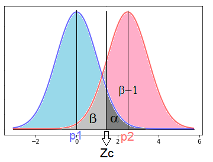
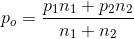
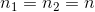
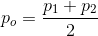
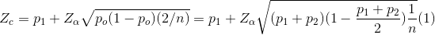
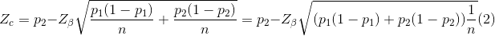
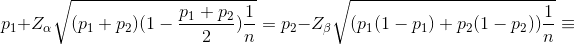
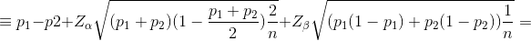
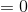

# power_prop_test
Function to compute the power or other parameters of a two-samples test for proportions. Function writen in python.

 
if:
 

 
 
then:
 

 
 
We have:
 

 
and
 

 
Once equations (1) and (2) are equal, we then have:
 
 

 

 

